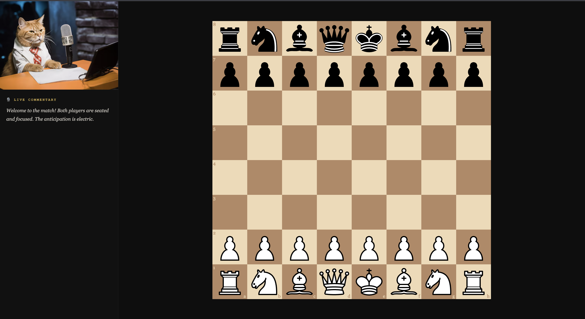

# Chess-Commentator

A Full-Stack AI Project that fine tunes open-source sec2sec model, google's SMALL-T5, on chess commentary.

## Prerequisites

- Download model from Hugging Face -- TBD
- Docker Desktop installed

## How To Run

- Default localhost ports are 5001:backend and 5173:frontend
- Run commandline: "docker-compose up --build" in project root directory /Chess-Commentator

## Upon Opening

